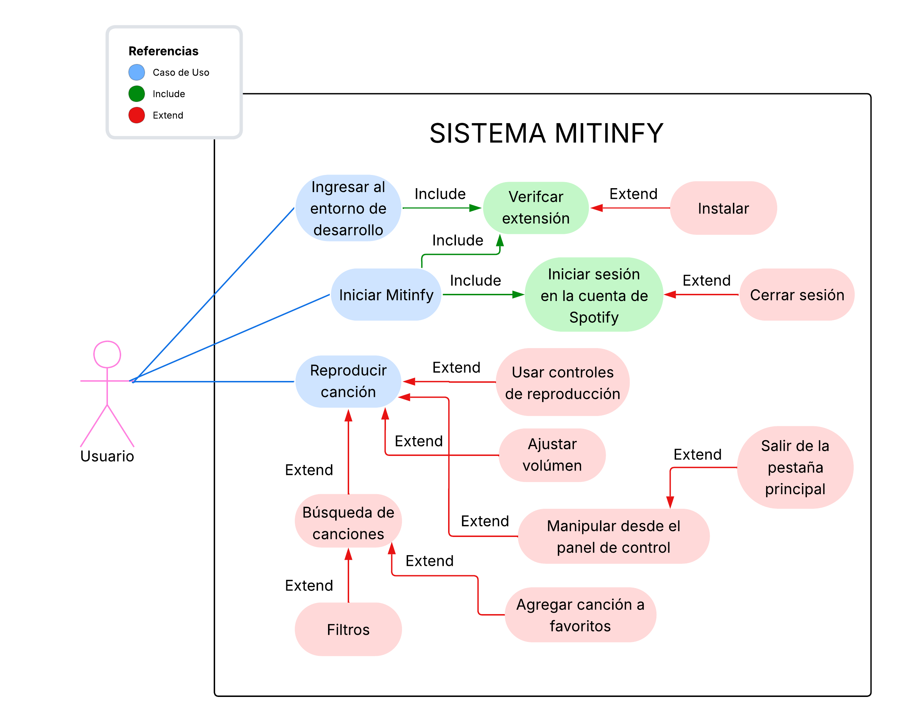

# 📂 Documentación del Proyecto

| Documento | Descripción |
|-----------|-------------|
| [Resultados del póker](https://docs.google.com/document/d/1UG2_36yvVg31dL7GuFqSrKlOiaPBwrcxc0rg5LKOW7k/edit?usp=sharing) | Documento donde se registraron los resultados de la dinámica de **Planning Poker**, utilizada para estimar esfuerzos y complejidad de las tareas. |
| [Historias de usuario ordenadas por prioridad](https://docs.google.com/document/d/1NIA49sTFhgTX3yRGzgB9swtjHQM63QzakhrXFYnA-yU/edit?tab=t.0) | Listado de historias de usuario clasificadas según la **prioridad de negocio**. Permite identificar qué funcionalidades son más valiosas para el cliente. |
| [Product Backlog](https://docs.google.com/document/d/1pMg3Lycjni8KeX4JcsyoBY3iWcqzlTNOmEFY3WklInU/edit?tab=t.0) | Organización de historias de usuario de acuerdo al **orden de implementación** (qué se desarrollará en cada sprint). |
| [Requerimientos](https://docs.google.com/document/d/1PDCrXZb8A9aer63ZzXCNB2RnfyVtSHVo1_PSKrdglZw/edit?usp=sharing) | Documento que describe los **requisitos funcionales y no funcionales** del sistema, base para el desarrollo y validación del proyecto. |
| [Documentación](https://docs.google.com/document/d/1JEQj2kHvRHuyn49CJd9IO4eas1ZD3WbcfSgqUcvw1LM/edit?usp=sharing) | Documento general donde se recopila la información del proyecto: **análisis, diseño, desarrollo y conclusiones**. |

## 📊 Diagramas del Proyecto

### Casos de Uso
Representa cómo interactúan los usuarios con el sistema y las funcionalidades principales que ofrece.

### Diagrama de Flujo
Muestra el flujo de procesos dentro del sistema, permitiendo entender la secuencia de operaciones.

